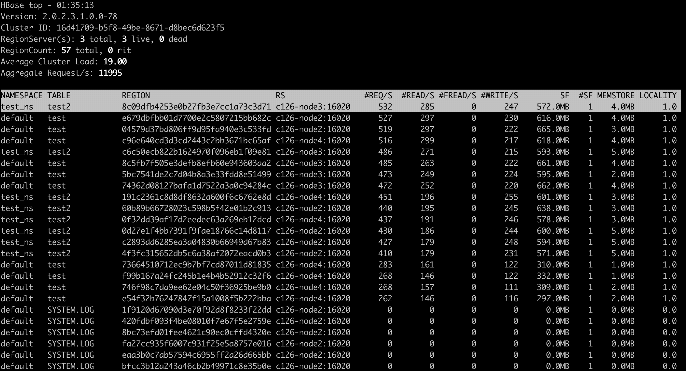
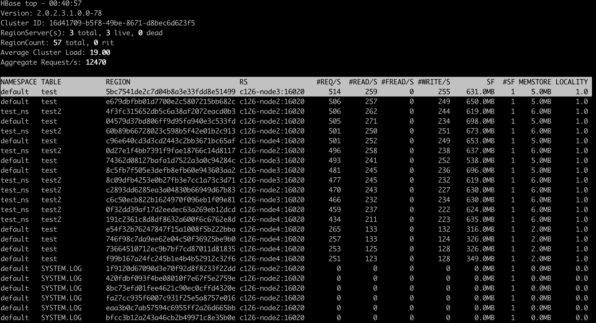
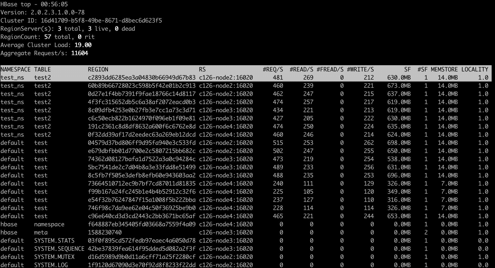
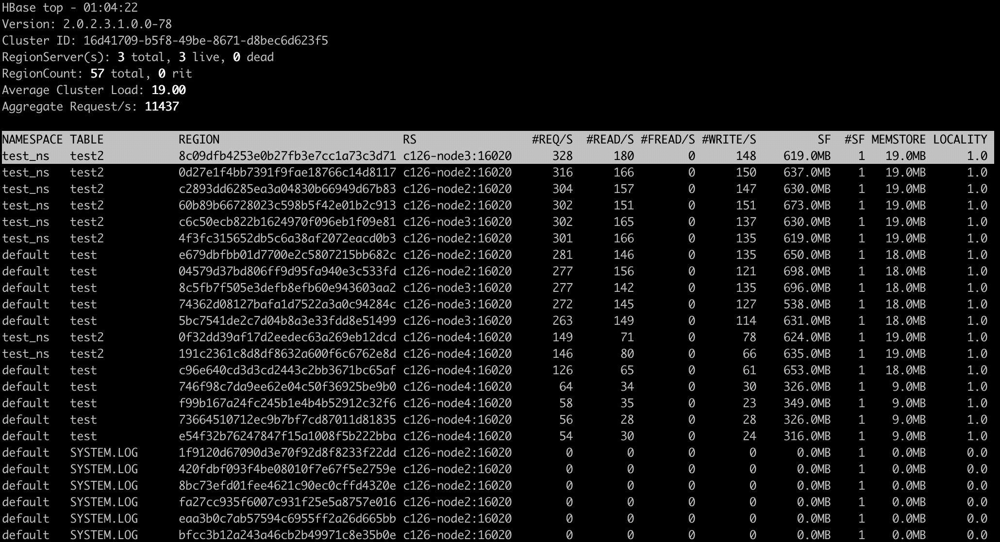
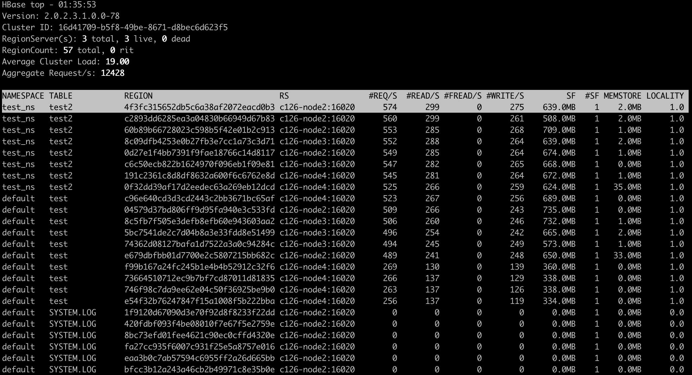
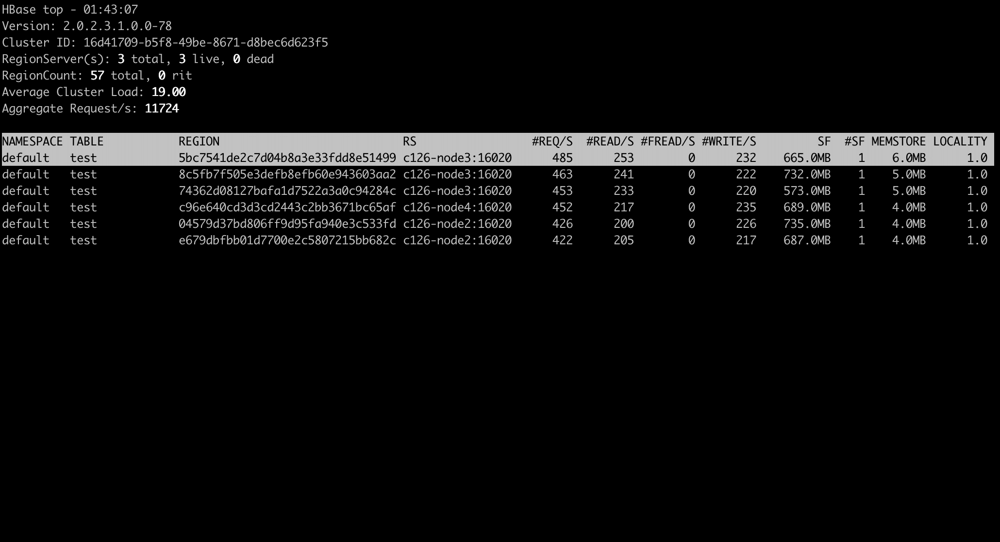
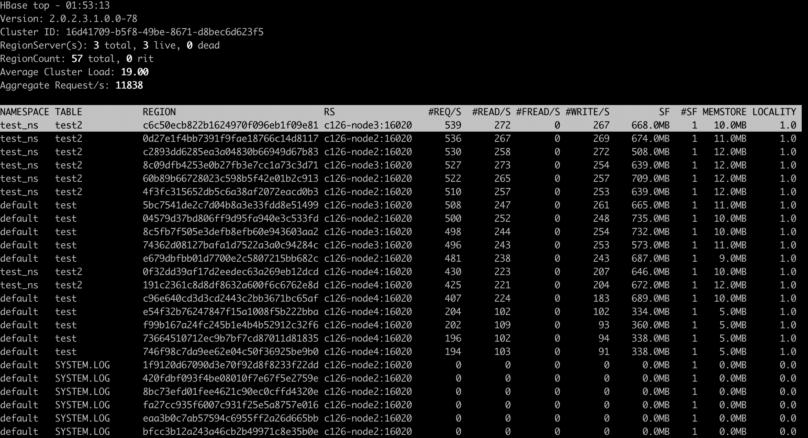
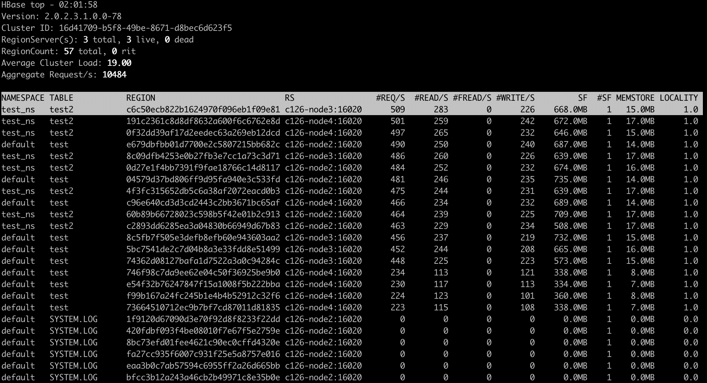

<!---
Licensed to the Apache Software Foundation (ASF) under one
or more contributor license agreements.  See the NOTICE file
distributed with this work for additional information
regarding copyright ownership.  The ASF licenses this file
to you under the Apache License, Version 2.0 (the
"License"); you may not use this file except in compliance
with the License.  You may obtain a copy of the License at

  http://www.apache.org/licenses/LICENSE-2.0

Unless required by applicable law or agreed to in writing,
software distributed under the License is distributed on an
"AS IS" BASIS, WITHOUT WARRANTIES OR CONDITIONS OF ANY
KIND, either express or implied.  See the License for the
specific language governing permissions and limitations
under the License.
-->

# hbtop

## Overview

`hbtop` is a real-time monitoring tool for HBase like Unix's top command.
It can display summary information as well as metrics per Region/Namespace/Table/RegionServer.
In this tool, you can see the metrics sorted by a selected field and filter the metrics to see only metrics you really want to see.
Also, with the drill-down feature, you can find hot regions easily in a top-down manner.

## Usage

You can run hbtop with the following command:

```
$ hbase hbtop
```

In this case, the values of `hbase.client.zookeeper.quorum` and `zookeeper.znode.parent` in `hbase-site.xml` in the classpath or the default values of them are used to connect.

Or, you can specify your own zookeeper quorum and znode parent as follows:

```
$ hbase hbtop -Dhbase.client.zookeeper.quorum=<zookeeper quorum> -Dzookeeper.znode.parent=<znode parent>
```


The top screen consists of a summary part and of a metrics part.
In the summary part, you can see `HBase Version`, `Cluster ID`, `The number of region servers`, `Region count`, `Average Cluster Load` and `Aggregated Request/s`.
In the metrics part, you can see metrics per Region/Namespace/Table/RegionServer depending on the selected mode.
The top screen is refreshed in a certain period – 3 seconds by default.

### Scrolling metric records

You can scroll the metric records in the metrics part.


### Command line arguments

| Argument | Description |
|---|---|
| -d,--delay &lt;arg&gt; | The refresh delay (in seconds); default is 3 seconds |
| -h,--help | Print usage; for help while the tool is running press `h` key |
| -m,--mode &lt;arg&gt; | The mode; `n` (Namespace)&#124;`t` (Table)&#124;r (Region)&#124;`s` (RegionServer), default is `r` (Region) |

### Modes

There are the following 4 modes in hbtop:

| Mode | Description |
|---|---|
| Region | Showing metric records per region |
| Namespace | Showing metric records per namespace |
| Table | Showing metric records per table |
| RegionServer | Showing metric records per region server |

#### Region mode

In Region mode, the default sort field is `#REQ/S`.

The fields in this mode are as follows:

| Field | Description | Displayed by default |
|---|---|---|
| RNAME | Region Name | false |
| NAMESPACE | Namespace Name | true |
| TABLE | Table Name | true |
| SCODE | Start Code | false |
| REPID | Replica ID | false |
| REGION | Encoded Region Name | true |
| RS | Short Region Server Name | true |
| LRS | Long Region Server Name | false |
| #REQ/S | Request Count per second | true |
| #READ/S | Read Request Count per second | true |
| #FREAD/S | Filtered Read Request Count per second | true |
| #WRITE/S | Write Request Count per second | true |
| SF | StoreFile Size | true |
| USF | Uncompressed StoreFile Size | false |
| #SF | Number of StoreFiles | true |
| MEMSTORE | MemStore Size | true |
| LOCALITY | Block Locality | true |
| SKEY | Start Key | false |
| #COMPingCELL | Compacting Cell Count | false |
| #COMPedCELL | Compacted Cell Count | false |
| %COMP | Compaction Progress | false |
| LASTMCOMP | Last Major Compaction Time | false |

#### Namespace mode

In Namespace mode, the default sort field is `#REQ/S`.

The fields in this mode are as follows:

| Field | Description | Displayed by default |
|---|---|---|
| NAMESPACE | Namespace Name | true |
| #REGION | Region Count | true |
| #REQ/S | Request Count per second | true |
| #READ/S | Read Request Count per second | true |
| #FREAD/S | Filtered Read Request Count per second | true |
| #WRITE/S | Write Request Count per second | true |
| SF | StoreFile Size | true |
| USF | Uncompressed StoreFile Size | false |
| #SF | Number of StoreFiles | true |
| MEMSTORE | MemStore Size | true |

#### Table mode

In Table mode, the default sort field is `#REQ/S`.

The fields in this mode are as follows:

| Field | Description | Displayed by default |
|---|---|---|
| NAMESPACE | Namespace Name | true |
| TABLE | Table Name | true |
| #REGION | Region Count | true |
| #REQ/S | Request Count per second | true |
| #READ/S | Read Request Count per second | true |
| #FREAD/S | Filtered Read Request Count per second | true |
| #WRITE/S | Write Request Count per second | true |
| SF | StoreFile Size | true |
| USF | Uncompressed StoreFile Size | false |
| #SF | Number of StoreFiles | true |
| MEMSTORE | MemStore Size | true |

#### RegionServer mode

In RegionServer mode, the default sort field is `#REQ/S`.

The fields in this mode are as follows:

| Field | Description | Displayed by default |
|---|---|---|
| RS | Short Region Server Name | true |
| LRS | Long Region Server Name | false |
| #REGION | Region Count | true |
| #REQ/S | Request Count per second | true |
| #READ/S | Read Request Count per second | true |
| #FREAD/S | Filtered Read Request Count per second | true |
| #WRITE/S | Write Request Count per second | true |
| SF | StoreFile Size | true |
| USF | Uncompressed StoreFile Size | false |
| #SF | Number of StoreFiles | true |
| MEMSTORE | MemStore Size | true |
| UHEAP | Used Heap Size | true |
| MHEAP | Max Heap Size | true |

### Changing mode

You can change mode by pressing `m` key in the top screen.



### Changing the refresh delay

You can change the refresh by pressing `d` key in the top screen.


### Changing the displayed fields

You can move to the field screen by pressing `f` key in the top screen. In the fields screen, you can change the displayed fields by choosing a field and pressing `d` key or `space` key.



### Changing the sort field

You can move to the fields screen by pressing `f` key in the top screen. In the field screen, you can change the sort field by choosing a field and pressing `s`. Also, you can change the sort order (ascending or descending) by pressing `R` key.




### Changing the order of the fields

You can move to the fields screen by pressing `f` key in the top screen. In the field screen, you can change the order of the fields.



### Filters

You can filter the metric records with the filter feature. We can add filters by pressing `o` key for ignoring case or `O` key for case sensitive.



The syntax is as follows:
```
<Field><Operator><Value>
```

For example, we can add filters like the following:
```
NAMESPACE==default
REQ/S>1000
```

The operators we can specify are as follows:

| Operator | Description |
|---|---|
| = | Partial match |
| == | Exact match |
| > | Greater than |
| >= | Greater than or equal to |
| < | Less than |
| <= | Less than and equal to |

You can see the current filters by pressing `^o` key and clear them by pressing `=` key.



### Drilling down

You can drill down the metric record by choosing a metric record that you want to drill down and pressing `i` key in the top screen. With this feature, you can find hot regions easily in a top-down manner.



### Help screen

You can see the help screen by pressing `h` key in the top screen.



## Others

### How hbtop gets the metrics data

hbtop gets the metrics from ClusterMetrics which is returned as the result of a call to Admin#getClusterMetrics() on the current HMaster. To add metrics to hbtop, they will need to be exposed via ClusterMetrics.
